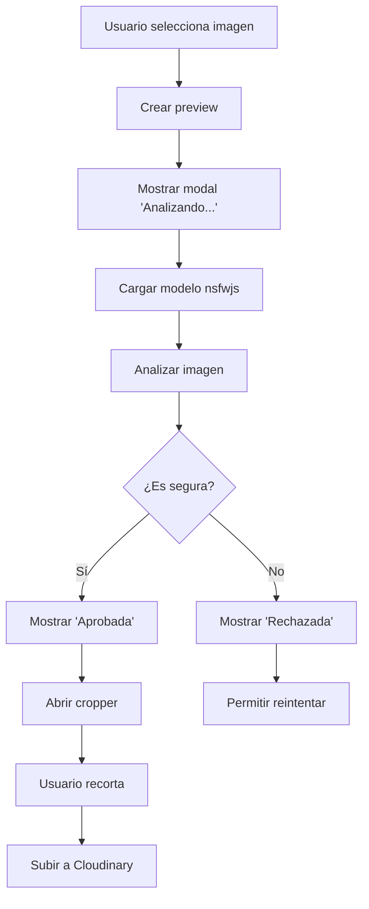

# Sistema de Moderación NSFW

## Descripción General

Este sistema implementa detección automática de contenido NSFW (Not Safe For Work) en las imágenes de perfil de usuarios utilizando la biblioteca **nsfwjs**, que está basada en TensorFlow.js y machine learning.

## ¿Cómo Funciona?

### Arquitectura

El sistema utiliza un modelo de machine learning pre-entrenado que analiza imágenes y las clasifica en 5 categorías:

1. **Porn** - Contenido pornográfico explícito
2. **Hentai** - Contenido hentai/anime explícito
3. **Sexy** - Contenido sugestivo/provocativo
4. **Neutral** - Contenido neutral/apropiado
5. **Drawing** - Dibujos/ilustraciones

### Flujo de Validación



### Implementación Client-Side

La detección se ejecuta **completamente en el navegador** antes de subir cualquier imagen:

**Ventajas:**
- ✅ Feedback inmediato al usuario (2-5 segundos)
- ✅ Ahorro de costos de almacenamiento (imágenes rechazadas no se suben)
- ✅ Menor carga en el servidor
- ✅ Mayor privacidad (análisis local)

**Limitaciones:**
- ⚠️ Usuarios técnicos podrían bypassear la validación client-side
- ⚠️ Requiere descargar modelo ML (~5MB) en primera carga
- ⚠️ Consume recursos del dispositivo del usuario

## Configuración

### Umbrales de Detección

Los umbrales se configuran en `.env`:

```bash
VITE_NSFW_PORN_THRESHOLD=60      # Rechazar si probabilidad > 60%
VITE_NSFW_HENTAI_THRESHOLD=60    # Rechazar si probabilidad > 60%
VITE_NSFW_SEXY_THRESHOLD=80      # Rechazar si probabilidad > 80%
```

**Recomendaciones:**
- **Más estricto**: Valores entre 40-50 (más falsos positivos)
- **Balanceado**: Valores entre 60-70 (recomendado)
- **Más permisivo**: Valores entre 80-90 (más falsos negativos)

### Ajustar Umbrales

Para cambiar los umbrales, modifica los valores en tu archivo `.env`:

```bash
# Ejemplo: Configuración más estricta
VITE_NSFW_PORN_THRESHOLD=50
VITE_NSFW_HENTAI_THRESHOLD=50
VITE_NSFW_SEXY_THRESHOLD=70
```

## Archivos del Sistema

### Core

- **`/client/src/utils/nsfwDetector.js`** - Utilidad principal de detección
  - `loadModel()` - Carga el modelo TensorFlow
  - `analyzeImage()` - Analiza una imagen
  - `validateImageFile()` - Valida un archivo completo
  - `isImageSafe()` - Verifica si cumple umbrales

### UI Components

- **`/client/src/components/UI/NSFWAnalysisModal.jsx`** - Modal de análisis
- **`/client/src/components/UI/NSFWAnalysisModal.css`** - Estilos del modal

### Integración

- **`/client/src/components/Profile/UpdateMultipleImagesWithCrop.jsx`** - Componente integrado

## Uso

### Análisis Automático

El análisis se ejecuta automáticamente cuando el usuario selecciona una imagen:

```javascript
// El componente UpdateMultipleImagesWithCrop maneja todo automáticamente
<UpdateMultipleImagesWithCrop
    uid={user.uid}
    initialImages={userImages}
    onImagesChange={handleImagesChange}
    maxImages={6}
/>
```

### Uso Manual (Avanzado)

Si necesitas usar el detector en otro componente:

```javascript
import { validateImageFile } from '../../utils/nsfwDetector.js';

const handleImageUpload = async (file) => {
    try {
        const result = await validateImageFile(file);
        
        if (result.isSafe) {
            console.log('✅ Imagen aprobada');
            // Continuar con upload
        } else {
            console.log('❌ Imagen rechazada:', result.reason);
            // Mostrar error al usuario
        }
    } catch (error) {
        console.error('Error:', error);
    }
};
```

## Performance

### Tiempos de Carga

- **Primera carga del modelo**: 3-5 segundos
- **Análisis de imagen**: 1-3 segundos
- **Análisis subsecuentes**: 1-2 segundos (modelo cacheado)

### Optimizaciones

El sistema incluye varias optimizaciones:

1. **Caché del modelo** - El modelo se carga una sola vez por sesión
2. **Carga lazy** - Solo se carga cuando el usuario selecciona una imagen
3. **Pre-carga opcional** - Puedes pre-cargar el modelo en background:

```javascript
import { preloadModel } from '../../utils/nsfwDetector.js';

// Pre-cargar cuando el usuario llega a la página de perfil
useEffect(() => {
    preloadModel();
}, []);
```

## Experiencia de Usuario

### Estados del Modal

1. **Analizando** - Spinner animado mientras se analiza
2. **Aprobada** - Checkmark verde, auto-cierra en 1.5s
3. **Rechazada** - X roja, botones para reintentar o cancelar
4. **Error** - Advertencia, opción de reintentar

### Mensajes

- **Aprobada**: "¡Imagen aprobada! La imagen cumple con nuestras políticas"
- **Rechazada**: "Imagen rechazada. [Razón específica]"
- **Error**: "Error al analizar. No se pudo verificar la imagen"

## Troubleshooting

### El modelo no carga

**Problema**: Error "No se pudo cargar el modelo de detección"

**Soluciones**:
1. Verificar conexión a internet (modelo se descarga de CDN)
2. Verificar que no haya bloqueadores de contenido
3. Revisar consola del navegador para errores específicos

### Falsos Positivos

**Problema**: Imágenes apropiadas son rechazadas

**Soluciones**:
1. Ajustar umbrales en `.env` (aumentar valores)
2. Revisar logs de consola para ver predicciones exactas
3. Considerar implementar sistema de reportes

### Falsos Negativos

**Problema**: Imágenes inapropiadas pasan la validación

**Soluciones**:
1. Ajustar umbrales en `.env` (disminuir valores)
2. Implementar validación server-side adicional
3. Agregar sistema de reportes de usuarios

### Performance Lenta

**Problema**: El análisis tarda mucho tiempo

**Soluciones**:
1. Pre-cargar el modelo en background
2. Verificar que el dispositivo tenga recursos suficientes
3. Considerar limitar tamaño de imágenes antes del análisis

## Seguridad

### Limitaciones Client-Side

⚠️ **IMPORTANTE**: La validación client-side puede ser bypasseada por usuarios técnicos.

**Recomendaciones de seguridad adicionales**:

1. **Validación Server-Side** - Implementar segunda capa en el backend
2. **Moderación Manual** - Sistema de reportes y revisión manual
3. **Rate Limiting** - Limitar cantidad de uploads por usuario
4. **Logging** - Registrar intentos de upload rechazados

### Privacidad

✅ **Buenas noticias**: El análisis es completamente local
- Las imágenes NO se envían a servidores externos para análisis
- El modelo se ejecuta en el navegador del usuario
- Solo se suben imágenes que pasan la validación

## Métricas y Monitoreo

### Datos a Monitorear

Considera agregar analytics para:

1. **Tasa de rechazo** - % de imágenes rechazadas
2. **Categorías más comunes** - Qué categorías se detectan más
3. **Tiempo de análisis** - Performance del sistema
4. **Falsos positivos reportados** - Calidad del filtro

### Ejemplo de Logging

```javascript
// En nsfwDetector.js, agregar:
const result = isImageSafe(predictions);

// Log para analytics
console.log('NSFW Analysis:', {
    isSafe: result.isSafe,
    category: result.category,
    confidence: result.confidence,
    timestamp: new Date().toISOString()
});
```

## Roadmap de Mejoras

### Corto Plazo
- [ ] Sistema de reportes de falsos positivos
- [ ] Analytics y métricas de uso
- [ ] Tests automatizados

### Mediano Plazo
- [ ] Validación server-side como segunda capa
- [ ] Dashboard de moderación para admins
- [ ] Ajuste dinámico de umbrales

### Largo Plazo
- [ ] Modelo personalizado entrenado con datos de la app
- [ ] Detección de otros tipos de contenido (violencia, etc.)
- [ ] Sistema de aprendizaje continuo

## Referencias

- **nsfwjs**: https://github.com/infinitered/nsfwjs
- **TensorFlow.js**: https://www.tensorflow.org/js
- **Documentación del modelo**: https://nsfwjs.com/

## Soporte

Para preguntas o problemas:
1. Revisar esta documentación
2. Verificar logs de consola
3. Revisar issues en GitHub de nsfwjs
4. Contactar al equipo de desarrollo
