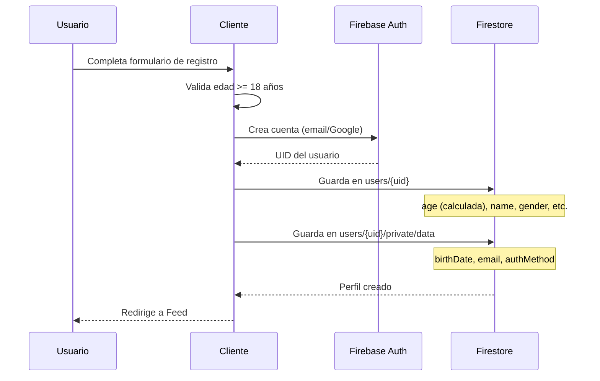
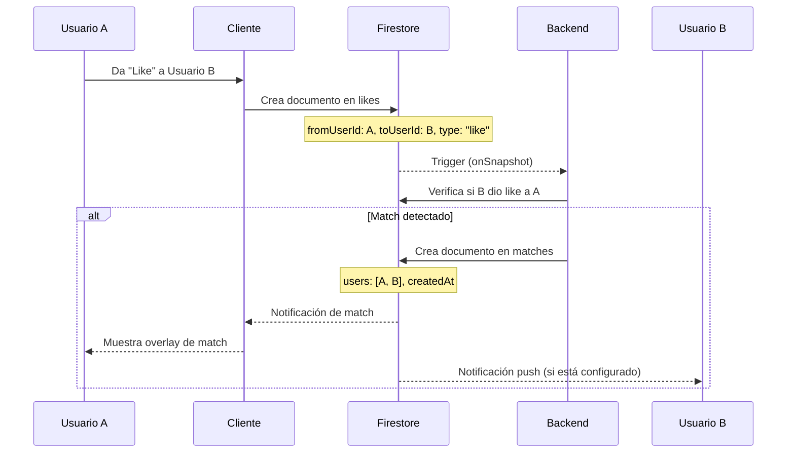
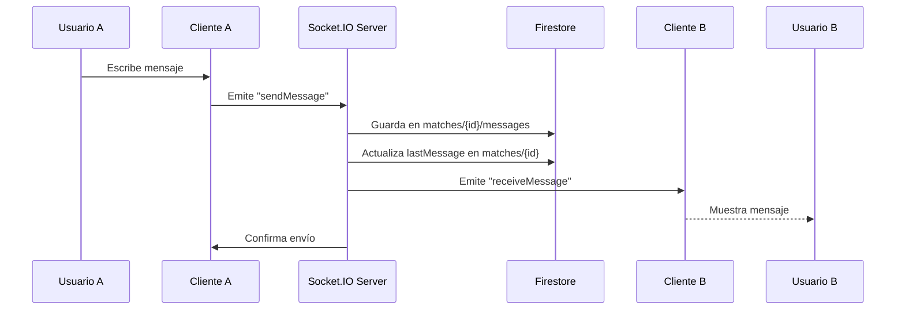
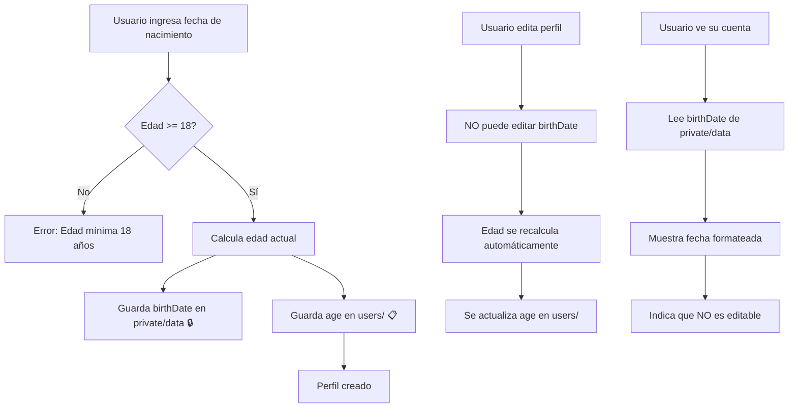

# 📊 Estructura de Datos de Firestore

> **Última actualización:** 30 de noviembre de 2025  
> **Versión de la App:** 0.9.0-rc1

Esta documentación describe la estructura completa de la base de datos Firestore utilizada en la aplicación de citas.

---

## 📑 Índice

1. [Colecciones Principales](#colecciones-principales)
2. [Subcolecciones](#subcolecciones)
3. [Índices Compuestos](#índices-compuestos)
4. [Reglas de Seguridad](#reglas-de-seguridad)
5. [Diagrama de Relaciones](#diagrama-de-relaciones)
6. [Flujos de Datos](#flujos-de-datos)

---

## 📁 Colecciones Principales

### 1. `users` (Colección Pública)

Almacena la información **pública** del perfil de usuario visible para otros usuarios.

#### Documento: `users/{userId}`

```javascript
{
  // ===== Información Básica =====
  uid: string,                    // ID único del usuario (Firebase Auth UID)
  name: string,                   // Nombre del usuario
  age: number,                    // Edad (calculada automáticamente desde birthDate)
  
  // ===== Identidad y Orientación =====
  gender: string,                 // Género: "Hombre", "Mujer", "No binario", etc.
  sexualOrientation: string,      // Orientación: "Heterosexual", "Homosexual", "Bisexual", etc.
  
  // ===== Perfil =====
  bio: string,                    // Biografía del usuario (máx 500 caracteres)
  interests: string[],            // Array de intereses (máx 8)
                                  // Ej: ["Música", "Viajes", "Deportes"]

  // ===== Estilo de Vida =====
  lifestyle: {
    drink: string,                // "Frecuentemente", "Socialmente", "Nunca", "Prefiero no decir"
    smoke: string,                // "Fumador", "No fumador", "Ocasionalmente", "Prefiero no decir"
    workout: string,              // "Diario", "A veces", "Nunca", "Prefiero no decir"
    zodiac: string,               // Signo zodiacal: "Aries", "Tauro", etc.
    height: string                // Altura en cm: "170", "180", etc.
  },

  // ===== Información Profesional =====
  job: {
    title: string,                // Ocupación / Puesto: "Ingeniero", "Diseñador", etc.
    company: string,              // Empresa donde trabaja
    education: string             // Nivel educativo: "Universitario", "Posgrado", etc.
  },

  // ===== Intenciones =====
  searchIntent: string,           // "Relación seria", "Algo casual", "Amistad", "No lo sé aún"
  
  // ===== Multimedia =====
  images: string[],               // URLs de imágenes de Cloudinary (máx 9)
                                  // Optimizadas automáticamente
  
  // ===== Ubicación =====
  location: {
    country: string,              // País: "Argentina", "México", etc.
    state: string,                // Estado/Provincia
    city: string                  // Ciudad
  },
  
  // ===== Metadata =====
  createdAt: timestamp,           // Fecha de creación del perfil
  updatedAt: timestamp            // Última actualización (opcional)
}
```

**Permisos:**
- **Lectura:** Cualquier usuario autenticado
- **Escritura:** Solo el propietario del perfil

---

### 2. `likes` (Colección)

Almacena las interacciones de "me gusta" y "no me gusta" entre usuarios.

#### Documento: `likes/{likeId}`

```javascript
{
  fromUserId: string,             // UID del usuario que da el like/pass
  toUserId: string,               // UID del usuario que recibe el like/pass
  type: "like" | "pass",          // Tipo de interacción
  createdAt: timestamp            // Fecha y hora de la interacción
}
```

**Permisos:**
- **Lectura:** Cualquier usuario autenticado
- **Creación:** Solo si `fromUserId` coincide con el usuario autenticado
- **Eliminación:** Solo el creador del like
- **Actualización:** No permitida

**Índices Compuestos:**
- `fromUserId` + `toUserId` + `type` (para verificar likes existentes)
- `toUserId` + `fromUserId` + `type` (para detección de matches)

---

### 3. `matches` (Colección)

Almacena los matches (likes mutuos) entre usuarios.

#### Documento: `matches/{matchId}`

```javascript
{
  users: string[],                // Array con los 2 UIDs [userId1, userId2]
                                  // Ordenados alfabéticamente para consistencia
  createdAt: timestamp,           // Fecha del match
  lastMessage: string | null,     // Preview del último mensaje
  lastMessageTime: timestamp | null // Timestamp del último mensaje
}
```

**Permisos:**
- **Lectura:** Solo usuarios involucrados en el match
- **Creación:** Backend (Firebase Admin SDK) o usuarios involucrados
- **Actualización:** Solo usuarios involucrados (para actualizar lastMessage)
- **Eliminación:** Solo usuarios involucrados (unmatch)

**Índices Compuestos:**
- `users` (array-contains) + `createdAt` (DESC) - Para listar matches de un usuario

---

### 4. `reports` (Colección)

Almacena reportes de usuarios por comportamiento inapropiado.

#### Documento: `reports/{reportId}`

```javascript
{
  reporterId: string,             // UID del usuario que reporta
  reportedId: string,             // UID del usuario reportado
  reason: string,                 // Motivo del reporte
                                  // "Spam", "Contenido inapropiado", "Acoso", etc.
  details: string,                // Detalles adicionales (opcional)
  status: string,                 // Estado: "pending", "reviewed", "resolved"
  createdAt: timestamp            // Fecha del reporte
}
```

**Permisos:**
- **Lectura:** No permitida desde cliente (solo Admin SDK)
- **Creación:** Solo si `reporterId` coincide con usuario autenticado
- **Actualización/Eliminación:** No permitida desde cliente

---

## 🔒 Subcolecciones

### `users/{userId}/private` (Subcolección Privada)

Almacena información **sensible y privada** del usuario.

#### Documento: `users/{userId}/private/data`

```javascript
{
  // ===== Información de Cuenta =====
  email: string,                  // Email del usuario (Firebase Auth)
  
  // ===== Información Sensible =====
  birthDate: string,              // Fecha de nacimiento: "YYYY-MM-DD"
                                  // ⚠️ NO EDITABLE después del registro
                                  // Se usa para calcular edad automáticamente
  
  // ===== Metadata de Autenticación =====
  authMethod: string,             // "email" | "google"
  emailVerified: boolean          // Si el email está verificado
}
```

**Permisos:**
- **Lectura/Escritura:** Solo el propietario
- **Actualización:** Permitida EXCEPTO para `birthDate` (inmutable)

---

#### Documento: `users/{userId}/private/fcmTokens`

```javascript
{
  tokens: string[],               // Array de tokens FCM para notificaciones push
  updatedAt: timestamp            // Última actualización
}
```

**Permisos:**
- **Lectura/Escritura:** Solo el propietario

---

### `users/{userId}/notifications` (Subcolección)

Almacena notificaciones del usuario.

#### Documento: `users/{userId}/notifications/{notificationId}`

```javascript
{
  type: string,                   // "match", "message", "like"
  fromUserId: string,             // UID del usuario que generó la notificación
  matchId: string,                // ID del match (si aplica)
  message: string,                // Mensaje de la notificación
  read: boolean,                  // Si fue leída
  createdAt: timestamp            // Fecha de creación
}
```

**Permisos:**
- **Lectura/Escritura:** Solo el propietario

---

### `matches/{matchId}/messages` (Subcolección)

Almacena el historial de mensajes de cada match.

#### Documento: `matches/{matchId}/messages/{messageId}`

```javascript
{
  senderId: string,               // UID del usuario que envió el mensaje
  text: string,                   // Contenido del mensaje
  timestamp: timestamp,           // Fecha y hora del mensaje
  read: boolean                   // Si el mensaje fue leído (opcional)
}
```

**Permisos:**
- **Lectura:** Solo usuarios del match
- **Creación:** Solo usuarios del match (y `senderId` debe coincidir)
- **Actualización/Eliminación:** No permitida

---

## 📊 Índices Compuestos

Los siguientes índices están definidos en `firestore.indexes.json`:

### Índices de `users`

```json
// Para filtrar por género, edad y ordenar por fecha
{
  "fields": [
    { "fieldPath": "gender", "order": "ASCENDING" },
    { "fieldPath": "age", "order": "ASCENDING" },
    { "fieldPath": "createdAt", "order": "DESCENDING" }
  ]
}

// Para filtrar por orientación sexual, edad y ordenar por fecha
{
  "fields": [
    { "fieldPath": "sexualOrientation", "order": "ASCENDING" },
    { "fieldPath": "age", "order": "ASCENDING" },
    { "fieldPath": "createdAt", "order": "DESCENDING" }
  ]
}

// Para filtrar por ubicación y ordenar por fecha
{
  "fields": [
    { "fieldPath": "location.country", "order": "ASCENDING" },
    { "fieldPath": "createdAt", "order": "DESCENDING" }
  ]
}
```

### Índices de `likes`

```json
// Para verificar likes existentes y detección de matches
{
  "fields": [
    { "fieldPath": "fromUserId", "order": "ASCENDING" },
    { "fieldPath": "toUserId", "order": "ASCENDING" },
    { "fieldPath": "type", "order": "ASCENDING" }
  ]
}

// Para búsqueda inversa (quién me dio like)
{
  "fields": [
    { "fieldPath": "toUserId", "order": "ASCENDING" },
    { "fieldPath": "fromUserId", "order": "ASCENDING" },
    { "fieldPath": "type", "order": "ASCENDING" }
  ]
}
```

### Índices de `matches`

```json
// Para listar matches de un usuario ordenados por fecha
{
  "fields": [
    { "fieldPath": "users", "arrayConfig": "CONTAINS" },
    { "fieldPath": "createdAt", "order": "DESCENDING" }
  ]
}
```

---

## 🔐 Reglas de Seguridad

Las reglas completas están en `firestore.rules`. Resumen:

### Funciones Auxiliares

```javascript
function isAuthenticated() {
  return request.auth != null;
}

function isOwner(userId) {
  return isAuthenticated() && request.auth.uid == userId;
}
```

### Reglas por Colección

| Colección | Lectura | Creación | Actualización | Eliminación |
|-----------|---------|----------|---------------|-------------|
| `users/{userId}` | ✅ Autenticado | ✅ Propietario | ✅ Propietario | ✅ Propietario |
| `users/{userId}/private/{docId}` | ✅ Propietario | ✅ Propietario | ✅ Propietario* | ✅ Propietario |
| `users/{userId}/notifications/{id}` | ✅ Propietario | ✅ Propietario | ✅ Propietario | ✅ Propietario |
| `likes/{likeId}` | ✅ Autenticado | ✅ Creador** | ❌ No | ✅ Creador |
| `matches/{matchId}` | ✅ Participante | ✅ Backend/Participante | ✅ Participante | ✅ Participante |
| `matches/{matchId}/messages/{id}` | ✅ Participante | ✅ Participante*** | ❌ No | ❌ No |
| `reports/{reportId}` | ❌ No | ✅ Reportador | ❌ No | ❌ No |

**Notas:**
- \* `birthDate` es inmutable en `private/data`
- \*\* Solo si `fromUserId` coincide con el usuario autenticado
- \*\*\* Solo si `senderId` coincide con el usuario autenticado

---

## 📊 Diagrama de Relaciones

```
┌─────────────────────────────────────────────────────────────┐
│                      FIRESTORE DATABASE                      │
└─────────────────────────────────────────────────────────────┘

users (collection)
├── {userId} (document) 📋 PÚBLICO
│   ├── uid, name, age, gender, sexualOrientation
│   ├── bio, interests[], images[]
│   ├── lifestyle{}, job{}, searchIntent
│   ├── location{country, state, city}
│   ├── createdAt, updatedAt
│   │
│   ├── private (subcollection) 🔒 PRIVADO
│   │   ├── data (document)
│   │   │   └── email, birthDate, authMethod, emailVerified
│   │   └── fcmTokens (document)
│   │       └── tokens[], updatedAt
│   │
│   └── notifications (subcollection) 🔔
│       └── {notificationId} (document)
│           └── type, fromUserId, matchId, message, read, createdAt

likes (collection) ❤️
└── {likeId} (document)
    └── fromUserId, toUserId, type, createdAt

matches (collection) 💬
└── {matchId} (document)
    ├── users[], createdAt, lastMessage, lastMessageTime
    │
    └── messages (subcollection)
        └── {messageId} (document)
            └── senderId, text, timestamp, read

reports (collection) 🚨
└── {reportId} (document)
    └── reporterId, reportedId, reason, details, status, createdAt
```

---

## 🔄 Flujos de Datos

### 1. Registro de Usuario



### 2. Sistema de Likes y Matches



### 3. Chat en Tiempo Real



### 4. Gestión de Edad y Fecha de Nacimiento



---

## 📝 Notas Importantes

### Seguridad y Privacidad

- ✅ **Separación de datos:** Información pública en `users/`, privada en `users/{id}/private/`
- ✅ **Fecha de nacimiento protegida:** Almacenada en subcolección privada e inmutable
- ✅ **Edad pública:** Calculada automáticamente, no editable manualmente
- ✅ **Reportes confidenciales:** Solo accesibles desde Admin SDK
- ✅ **Mensajes privados:** Solo visibles para participantes del match

### Validaciones

| Campo | Validación |
|-------|------------|
| `age` | Mínimo 18 años |
| `birthDate` | Formato YYYY-MM-DD, últimos 100 años |
| `bio` | Máximo 500 caracteres |
| `interests` | Máximo 8 elementos |
| `images` | Máximo 9 URLs |
| `name` | Mínimo 2 caracteres |

### Optimizaciones

- **Caché local:** IndexedDB con `localforage` para perfiles del feed
- **Batch loading:** Carga de 15-25 perfiles por lote
- **Prefetch:** Carga anticipada cuando quedan < 5 perfiles
- **Índices compuestos:** Queries optimizadas para filtros complejos

### Cálculo de Edad

La edad se calcula automáticamente en:
1. **Registro:** Al crear el perfil inicial
2. **Actualización:** Al editar cualquier campo del perfil
3. **Visualización:** Al obtener datos del usuario

Esto garantiza que la edad siempre esté actualizada sin intervención manual.

---

## 🚀 Despliegue de Índices y Reglas

```bash
# Desplegar índices compuestos
firebase deploy --only firestore:indexes

# Desplegar reglas de seguridad
firebase deploy --only firestore:rules

# Desplegar ambos
firebase deploy --only firestore
```

---

**Documentación mantenida por:** Pauliih Darkness Dev  
**Última revisión:** 30 de noviembre de 2025  
**Versión:** 0.9.0-rc1
